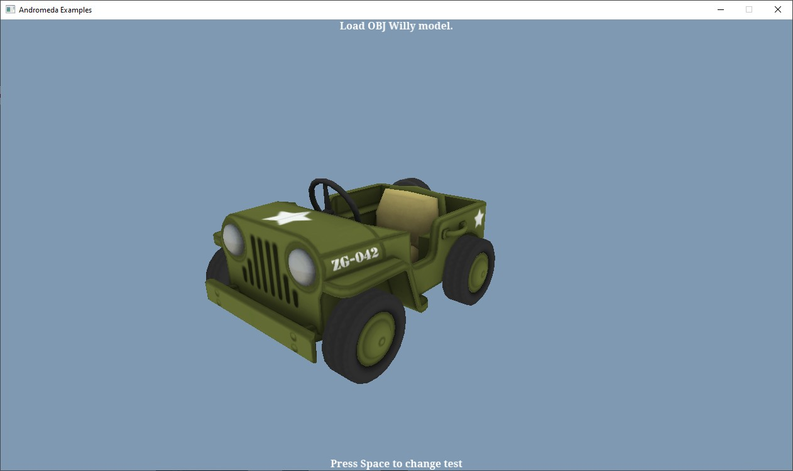

<!--
*** Thanks for checking out the Best-README-Template. If you have a suggestion
*** that would make this better, please fork the repo and create a pull request
*** or simply open an issue with the tag "enhancement".
*** Thanks again! Now go create something AMAZING! :D
***
***
***
*** To avoid retyping too much info. Do a search and replace for the following:
*** github_username, repo_name, twitter_handle, email, project_title, project_description
-->


<!-- PROJECT SHIELDS -->
<!--
*** I'm using markdown "reference style" links for readability.
*** Reference links are enclosed in brackets [ ] instead of parentheses ( ).
*** See the bottom of this document for the declaration of the reference variables
*** for contributors-url, forks-url, etc. This is an optional, concise syntax you may use.
*** https://www.markdownguide.org/basic-syntax/#reference-style-links
-->

<!-- PROJECT LOGO -->
<br />
<p align="center">
  <a href="https://github.com/DrakonPL/Andromeda-Lib">
    
  </a>

  <h3 align="center">Andromeda Examples</h3>

  <p align="center">
    Source code of examples on how to use my cross platform library.
    <br />
    <br />
    <a href="https://github.com/DrakonPL/Andromeda-Lib">View Lib</a>
    ·
    <a href="https://github.com/DrakonPL/Andromeda-Examples/issues">Report Bug</a>
    ·
    <a href="https://github.com/DrakonPL/Andromeda-Examples/issues">Request Feature</a>
  </p>
</p>


<!-- TABLE OF CONTENTS -->
<details open="open">
  <summary><h2 style="display: inline-block">Table of Contents</h2></summary>
  <ol>
    <li>
      <a href="#about-the-project">About The Project</a>
      <ul>
        <li><a href="#built-with">Built With</a></li>
      </ul>
    </li>
    <li>
      <a href="#getting-started">Getting Started</a>
      <ul>
        <li><a href="#prerequisites">Prerequisites</a></li>
        <li><a href="#installation">Installation</a></li>
      </ul>
    </li>
    <li><a href="#usage">Usage</a></li>
    <li><a href="#examples">Examples</a></li>
    <li><a href="#contributing">Contributing</a></li>
    <li><a href="#license">License</a></li>
    <li><a href="#contact">Contact</a></li>
    <li><a href="#acknowledgements">Acknowledgements</a></li>
  </ol>
</details>


<!-- ABOUT THE PROJECT -->
## About The Project

Here's a blank template to get started:
**To avoid retyping too much info. Do a search and replace with your text editor for the following:**
`github_username`, `repo_name`, `twitter_handle`, `email`, `project_title`, `project_description`


### Built With

* []()
* []()
* []()


<!-- GETTING STARTED -->
## Getting Started

To get a local copy up and running follow these simple steps.

### Prerequisites

This is an example of how to list things you need to use the software and how to install them.
* npm
  ```sh
  npm install npm@latest -g
  ```

### Installation

1. Clone the repo
   ```sh
   git clone https://github.com/github_username/repo_name.git
   ```
2. Install NPM packages
   ```sh
   npm install
   ```


<!-- USAGE EXAMPLES -->
## Usage

Use this space to show useful examples of how a project can be used. Additional screenshots, code examples and demos work well in this space. You may also link to more resources.

_For more examples, please refer to the [Documentation](https://example.com)_


<!-- EXAMPLES -->
## Examples

See the [open issues](https://github.com/github_username/repo_name/issues) for a list of proposed features (and known issues).

1. Simple triangle - color in shader
<br />
<p align="center">
  <a href="https://github.com/DrakonPL/Andromeda-Examples/blob/master/Examples/Basic/Test1.cpp">
    
  </a>
</p>

2. Simple triangle - color is passed as an uniform to shader
<br />
<p align="center">
  <a href="https://github.com/DrakonPL/Andromeda-Examples/blob/master/Examples/Basic/Test2.cpp">
    
  </a>
</p>

3. Simple triangle - vertex colours
<br />
<p align="center">
  <a href="https://github.com/DrakonPL/Andromeda-Examples/blob/master/Examples/Basic/Test3.cpp">
    
  </a>
</p>

4. Simple tiangle - using textures
<br />
<p align="center">
  <a href="https://github.com/DrakonPL/Andromeda-Examples/blob/master/Examples/Basic/Test4.cpp">
    
  </a>
</p>

5. Simple triangle - passing transformation matrix to shader
<br />
<p align="center">
  <a href="https://github.com/DrakonPL/Andromeda-Examples/blob/master/Examples/Basic/Test5.cpp">
    
  </a>
</p>

6. Textured cube
<br />
<p align="center">
  <a href="https://github.com/DrakonPL/Andromeda-Examples/blob/master/Examples/Basic/Test6.cpp">
    
  </a>
</p>

7. Font system - atlas texture test
<br />
<p align="center">
  <a href="https://github.com/DrakonPL/Andromeda-Examples/blob/master/Examples/FreeTypeTests/TestFreeTypeAtlas.cpp">
    
  </a>
</p>

8. Drawing simple sprites example
<br />
<p align="center">
  <a href="https://github.com/DrakonPL/Andromeda-Examples/blob/master/Examples/Basic/TestSprite.cpp">
    
  </a>
</p>

9. Simple camera system and input example
<br />
<p align="center">
  <a href="https://github.com/DrakonPL/Andromeda-Examples/blob/master/Examples/Basic/TestCam3d.cpp">
    
  </a>
</p>

10. Render to texture
<br />
<p align="center">
  <a href="https://github.com/DrakonPL/Andromeda-Examples/blob/master/Examples/Basic/TestToTexture.cpp">
    
  </a>
</p>

11. Loading OBJ model example 1
<br />
<p align="center">
  <a href="https://github.com/DrakonPL/Andromeda-Examples/blob/master/Examples/Models/TestObjModel.cpp">
    
  </a>
</p>

12. Loading OBJ model example 2
<br />
<p align="center">
  <a href="https://github.com/DrakonPL/Andromeda-Examples/blob/master/Examples/Models/TestObjKart.cpp">
    
  </a>
</p>

13. Light sample - simple scene
<br />
<p align="center">
  <a href="https://github.com/DrakonPL/Andromeda-Examples/blob/master/Examples/Lightening/TestLight1.cpp">
    
  </a>
</p>

14. Light sample - some actual lightening 
<br />
<p align="center">
  <a href="https://github.com/DrakonPL/Andromeda-Examples/blob/master/Examples/Lightening/TestLight2.cpp">
    
  </a>
</p>

15. Light sample - more magic
<br />
<p align="center">
  <a href="https://github.com/DrakonPL/Andromeda-Examples/blob/master/Examples/Lightening/TestLight3.cpp">
    
  </a>
</p>

16. Light sample - light and textures
<br />
<p align="center">
  <a href="https://github.com/DrakonPL/Andromeda-Examples/blob/master/Examples/Lightening/TestLight4.cpp">
    
  </a>
</p>

17. Loading GLTF models - static sample
<br />
<p align="center">
  <a href="https://github.com/DrakonPL/Andromeda-Examples/blob/master/Examples/Animation/TestAnimation1.cpp">
    
  </a>
</p>

18. Loading GLTF models - CPU animation
<br />
<p align="center">
  <a href="https://github.com/DrakonPL/Andromeda-Examples/blob/master/Examples/Animation/TestAnimation2.cpp">
    
  </a>
</p>

19. Loading GLTF models - GPU animation
<br />
<p align="center">
  <a href="https://github.com/DrakonPL/Andromeda-Examples/blob/master/Examples/Animation/TestAnimation3.cpp">
    
  </a>
</p>

20. Loading GLTF models - animation test 1
<br />
<p align="center">
  <a href="https://github.com/DrakonPL/Andromeda-Examples/blob/master/Examples/Animation/AnimatedModelTest1.cpp">
    
  </a>
</p>

21. Loading GLTF models - animation test 2
<br />
<p align="center">
  <a href="https://github.com/DrakonPL/Andromeda-Examples/blob/master/Examples/Animation/AnimatedModelTest2.cpp">
    
  </a>
</p>

22. Integration with Bullet physics engine sample 1
<br />
<p align="center">
  <a href="https://github.com/DrakonPL/Andromeda-Examples/blob/master/Examples/Bullet/TestBullet3.cpp">
    
  </a>
</p>

23. Integration with Bullet physics engine sample 2
<br />
<p align="center">
  <a href="https://github.com/DrakonPL/Andromeda-Examples/blob/master/Examples/Bullet/TestBullet4.cpp">
    
  </a>
</p>

<!-- CONTRIBUTING -->
## Contributing

Contributions are what make the open source community such an amazing place to be learn, inspire, and create. Any contributions you make are **greatly appreciated**.

1. Fork the Project
2. Create your Feature Branch (`git checkout -b feature/AmazingFeature`)
3. Commit your Changes (`git commit -m 'Add some AmazingFeature'`)
4. Push to the Branch (`git push origin feature/AmazingFeature`)
5. Open a Pull Request


<!-- LICENSE -->
## License

Distributed under the MIT License. See `LICENSE` for more information.


<!-- CONTACT -->
## Contact

Your Name - [@twitter_handle](https://twitter.com/twitter_handle) - email

Project Link: [https://github.com/github_username/repo_name](https://github.com/github_username/repo_name)


<!-- ACKNOWLEDGEMENTS -->
## Acknowledgements

* []()
* []()
* []()


<!-- MARKDOWN LINKS & IMAGES -->
<!-- https://www.markdownguide.org/basic-syntax/#reference-style-links -->
[contributors-shield]: https://img.shields.io/github/contributors/DrakonPL/repo.svg?style=for-the-badge
[contributors-url]: https://github.com/DrakonPL/Andromeda-Examples/graphs/contributors
[forks-shield]: https://img.shields.io/github/forks/DrakonPL/repo.svg?style=for-the-badge
[forks-url]: https://github.com/DrakonPL/Andromeda-Examples/network/members
[stars-shield]: https://img.shields.io/github/stars/DrakonPL/repo.svg?style=for-the-badge
[stars-url]: https://github.com/DrakonPL/Andromeda-Examples/stargazers
[issues-shield]: https://img.shields.io/github/issues/DrakonPL/repo.svg?style=for-the-badge
[issues-url]: https://github.com/DrakonPL/Andromeda-Examples/issues
[license-shield]: https://img.shields.io/github/license/DrakonPL/repo.svg?style=for-the-badge
[license-url]: https://github.com/DrakonPL/Andromeda-Examples/blob/master/LICENSE.txt
[linkedin-shield]: https://img.shields.io/badge/-LinkedIn-black.svg?style=for-the-badge&logo=linkedin&colorB=555
